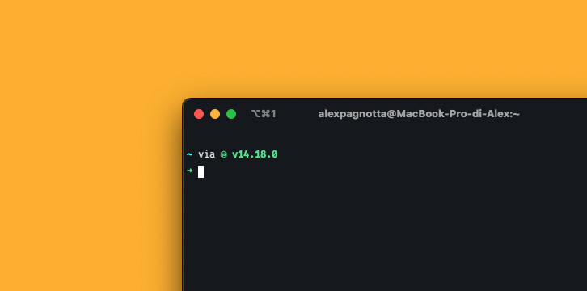

# Alex Dotfiles



<details open="open">
  <summary><h2 style="display: inline-block">Contents</h2></summary>
  <ul>
    <li>
      <a href="#about">About</a>
    </li>
    <li>
      <a href="#getting-started">Getting Started</a>
    </li>
    <li><a href="#run-the-scripts">Scripts</a>
    </li>
    <li><a href="#post-install">Post Install</a>
    <ul>
        <li><a href="#mac-os-settings">Manual Mac Os Setttings</a></li>
        <li><a href="#brew-permissions-fix">Brew permissions FIX</a></li>
        <li><a href="#ssh-keys">SSH keys</a></li>
    </ul>
    <li><a href="#todo">TODO</a></li>
  </ul>
</details>

## About

This repository contains all my M1 Macbook dotfiles, complete with scripts for an easy restore and instructions for manual steps.

### Profiles

As you can see there are three branches on this repository, each branch matches a profile on the mac, at the moment there is a personal branch and a work one, aside from the master branch that includes configs in common between the two.
The main differences are in the apps installed with brew and some changes in the config files.

## Pre Reset

Make sure that all the app configs that require a manual export are updated:

- Raycast (Save .rayconfig file in the config folders, and re-import from app)

- Warp Terminal (Run this command on the root of the project to update the settings file `defaults export dev.warp.Warp-Stable editors/files/warp-terminal/settings.plist`)

## Getting Started

- Clone the project wherever you want, using the command:

```bash
git clone git@github.com:AlexPagnotta/alex_dotfiles.git
```

- If you are not me, you probably would want to change something in the dotfiles, so edits the script/files and adjust them to your needs!

- Install Rosetta if you haven't already, you can do it with this command:

```bash
/usr/sbin/softwareupdate --install-rosetta
```

## Run the scripts

- BREW:
  Installs all brew packages, cask apps and fonts, run the brew.sh script first, and then the profile-specific script according to the branch you are in, so brew_personal.sh or brew_work.sh.

- DEV: This script will set up my dev environment.

- Config: Executing this script will symlink dotfiles to your home directory, these include ssh config, zshrc, git config etc.

- Editor: Configures VsCode complete with extensions, Sublime Text 3 and the Warp terminal.

## Post install

### Mac Os Settings

See the <a href="Manual_Settings.md">Manual_Settings.md</a> file for more info.

### SSH keys

Zsh shell is configured to run `ssh-add -A` at every start, this way ssh keys are always available,
For this to work you have to add your private key file to the agent using this command:

```bash
ssh-add -K ~/.ssh/private_key_file
```

SSH agent will only include keys protected by a password, so if you didn't set one while creating the key, you can do it by running:

```bash
ssh-keygen -p -f ~/.ssh/private_key_file
```

Once you have done it, you can add the key to the agent, after that, if you want, you can remove the password with the same command you used to set it.

### TODO

- Automate Mac Os preferences using a script
